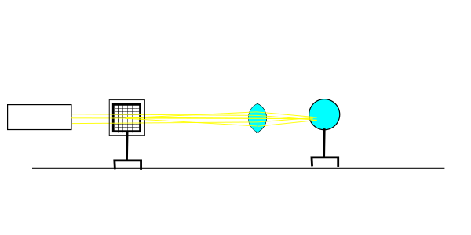
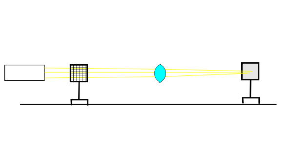
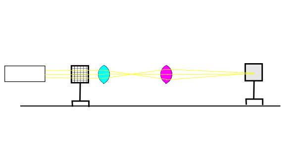
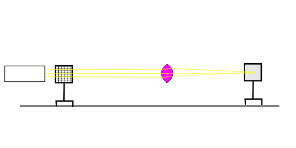

# report for TP2: Converging thin optical lenses

## Introduction

This TP aims to experimentally measure the focal lense of a converging optical lense and explore its practical optical properties, notably in the formation of a virtual/real reflected image.

## Experimental setup

For this TP, we have a graduated guide rail (1), three sliding lense mounts (2), a light source(3), a mirror(4), a gridded glass with sliding mount and detachable projection screen frame(5), a projection screen (6) and an additional converging lense (7) in addition to the converging optical lense (8)at the centre of our study.

## Experiemental procedure

### Rough estimation (Autocollimation)

We begin the experiment with a rough estimation of focal length by posing the lense between a distant, patterned light source (room lighting with grid, see figure 2) and a screen (a white table). We have observed that the pattern enters into focus at around 200 mm measuring by a meter ruler.

### Refined estimation (Autocollimation)

We repeated the autocollimation method with our guided rail. The lamp posed behind the gridded glass serves as a distant parallel light source, while the screen provides an identifiable pattern. The light is converged by the converging lenses, reflected by the mirror, then reconverged once again to form the image on the attached screen on the grid. We adjust the grid until a clear image is obtained.

We have thereon measured the focal length of the converging lense, which is equal to the distance between the grid and the lense, at 205 mm.

### Measurment with improved precision

With the Descarte's law: $\frac{1}{AO} + \frac{1}{OA'} = \frac{1}{OF'} \Leftrightarrow OF'=\frac{AO\cdot OA'{AO+OA'}$, we vary experimentally the distance of $AO$ by moving the grid, identify $OA'$ by moving the screen until a clear image is obtained, and calculate mathematically the focal length _f_ which is equal to $OF'$ 

To maximize precision, we repeat the measurement with 10 different $AO$.

#### Real image measurement

First, we set up the apparatus as such:

So a real image is obtained on the screen,

| $AO$ (measured)                            | 400     | 450     | 500     | 550     | 600     | 650     | 700     | 750     | 800     | 850     |
| ------------------------------------------ | ------- | ------- | ------- | ------- | ------- | ------- | ------- | ------- | ------- | ------- |
| $AA'$ (measured)                           | 824     | 827     | 857     | 883     | 916     | 953     | 993     | 1033    | 1078    | 1125    |
| $OA' = AA' - AO$                           | 424     | 377     | 357     | 333     | 316     | 303     | 293     | 283     | 278     | 275     |
| $f = OF' = \dfrac{AO \cdot OA'}{AO + OA'}$ | 205.825 | 205.139 | 208.285 | 207.418 | 206.987 | 206.663 | 206.546 | 205.470 | 206.308 | 207.778 |

#### Virtual image measuremebnt

As a virtual image cannot be directly visualised by a screen, we must use a second converging lense to perform indirect measurement.

Setting up as such, we adjust the object (grid) position (A) to an arbitary value slightly smaller than the focal length (estimated to be 205mm), then we adjust second converging lense until a clear image of the grid is obtained on the screen.

Then we retire the converging lense to be measured ("1st lense") and move the mirror until a clear image is obtained.

The position of the mirror is the position of the virtual image A'.

We thereby obtain the following results, in mm:

| $A$ (ruler reading)                        | 213     | 212     | 189     | 200     | 160     | 185     | 200     | 210     | 195     | 205     |
| ------------------------------------------ | ------- | ------- | ------- | ------- | ------- | ------- | ------- | ------- | ------- | ------- |
| $O$ (ruler reading)                        | 300     | 300     | 300     | 300     | 300     | 300     | 300     | 300     | 300     | 300     |
| $A'$ (ruler reading)                       | 146     | 140     | 46      | 110     | -117    | 39      | 104     | 141     | 103     | 132     |
| $AO = O - A$                               | 87      | 88      | 111     | 100     | 140     | 115     | 100     | 90      | 105     | 95      |
| $OA' = O - A'$                             | -154    | -160    | -254    | -190    | -417    | -261    | -196    | -159    | -197    | -168    |
| $f = OF' = \dfrac{OA \cdot OA'}{OA + OA'}$ | 199.970 | 195.556 | 197.161 | 211.111 | 210.758 | 205.582 | 204.167 | 207.391 | 224.837 | 218.630 |

# Statistical analysis

### Best estimate of true value

With 10 measurements of the same value, the true value is best estimated by the statistical mean:

$$\bar{x} = \frac{1}{n}\sum_{i=1}^{n} x_i$$

Which we calculated to be 206.6 mm with the real image method, and 207.5 mm with the virtual image method.

### 95% confidence interval

The 95% confidence interval of the true value can be mathematically calculated as such:

$$\bar{x} \pm t_{95%,df} \frac{s}{\sqrt{n}}$$

Where $t$ is the 95% confidence value according to the Student's distribution for degree of freedom $n-1=9$, $s$ is the standard sample deviation calculated by $s = \sqrt{\frac{1}{n-1}\sum_{i=1}^{n}(x_i-\bar{x})^2}$.

We have therefore the 95% confidence interval of the true value calculated as $206.7 \pm 0.7 mm$ for virtual image measurement, and $207.5 \pm 6.6 mm$ for real image meausrement. 

## Results interpretation

The best estimates of the focal lense obtained by the autocollimation, virtual image and real image conjugation methods concur. The virtual image method lead to the best overall accuracy, while the autocollimation method provided a rapid estimate. The virtual image method is found to be less accurate, as it is practically difficult to manipulate the grid so it corresponds exactly to the position of the virtual image, due to the fact that the image projected onto the screen is magnified and therefore difficult to discern whether a good focus is obtained. 

We thereby decide that the value obtained by the real image conjugation method, $206.7 \pm 0.7 mm$ should be accepted as our best estimate of the true focal length.

## Conclusion

In this experiment, with the aid of a graduated guide rail and various optical equipments, we indirected measured the focal length of a converging lense by three methods : autocollimation, real image conjugation, and virtual image conjugation. Our best estimate of the focal length $f$ is $206.7 mm$$
## Bibliographie

